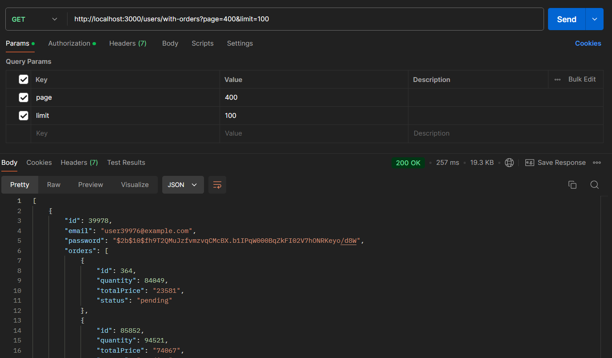
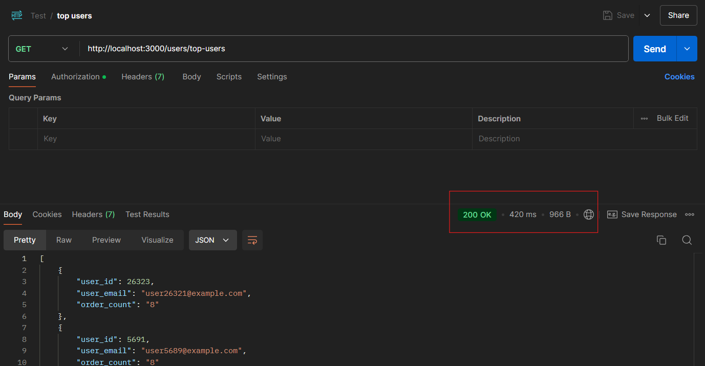
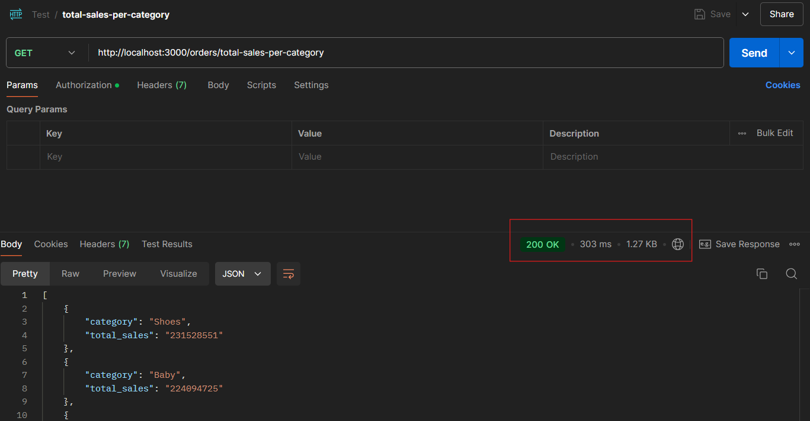
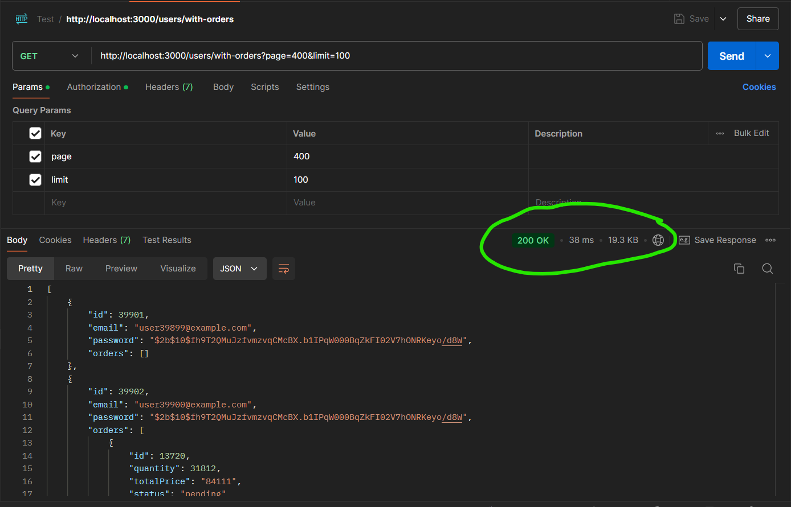
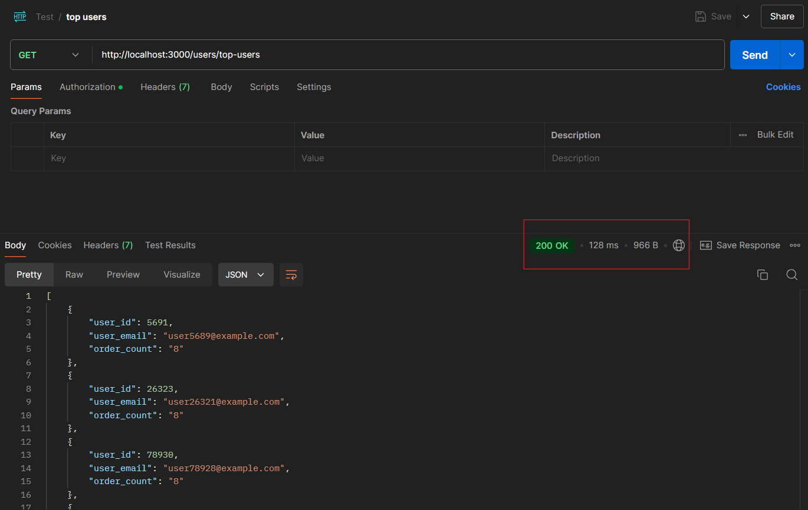
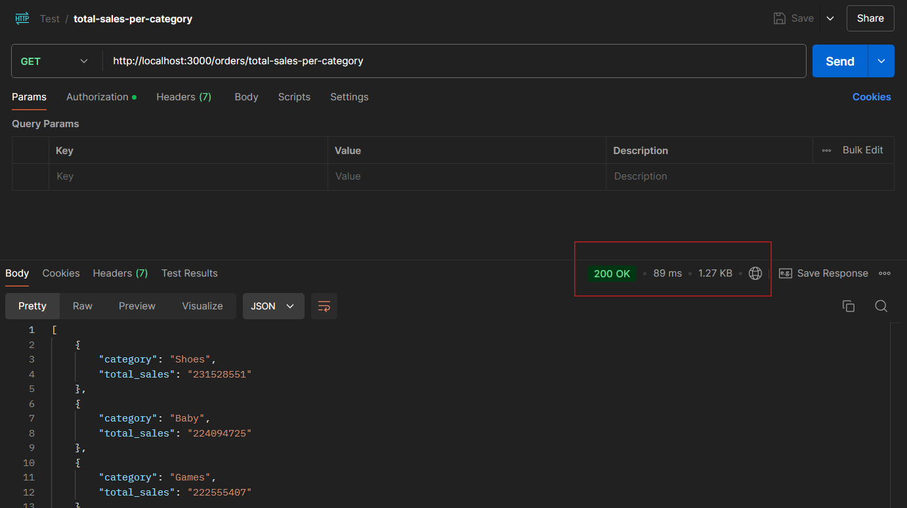

# NestJS REST API with TypeORM, JWT Authentication, PostgreSQL, Pagination, and Database Seeding
This project is a web application built with NestJS and TypeORM that interacts with a PostgreSQL database. The application includes user authentication using JWT, supports CRUD operations for users, products, and orders, and demonstrates pagination and the use of database indexing to improve query performance. Additionally, it includes a feature to seed 100,000 records into each table for performance testing.

## Features

- **JWT Authentication**: Secure user authentication and authorization using JSON Web Tokens (JWT).
- **CRUD Operations**: Create, read, update, and delete operations for users, products, and orders.
- **Pagination**: Supports paginated queries to efficiently fetch data.
- **Indexing**: Demonstrates the use of indexes to improve query performance, with before-and-after query comparisons.
- **Database Seeding**: Seeding functionality to populate the database with 100,000 records for performance testing.
- **PostgreSQL**: Uses PostgreSQL for storing and managing data.
- **Swagger Integration**: Easily test and document the API via Swagger.

## Project Structure
- **Users**: Handles user management, including registration, login, and JWT-based authentication.
- **Products**: Manages products with CRUD functionality.
- **Orders**: Manages orders and their association with users and products.

## Requirements
- Node.js (v14.x or later)
- PostgreSQL (v12.x or later)
- TypeORM
- NestJS CLI (optional, but recommended for development)

## Setup Instructions
1. Clone the Repository
```bash
git clone [https://github.com/yourusername/your-repository.git](https://github.com/sohanur-rahman0/node-task-01.git)
cd node-task-01
```
2. Install Dependencies
```bash

npm install
```
3. Set Up the PostgreSQL Database
Make sure you have PostgreSQL installed and running. Create a database for the project:

The application assumes the db username: postgress and password: pg. You can change it in app.module.ts 

```bash

# Connect to PostgreSQL
psql -U postgres

# Create a new database
CREATE DATABASE rest_api_db;
```
4. Configure Environment Variables
As it's a simple task and not for production environemnt. I haven't used .env file and the db credentials and jwt configs are hardcoded in the application.

5. Run Database Migrations (Optional)
No need to run database migrations. When the application initilize it will create all the table with indexs. 

6. Run the Application
Start the NestJS application:

```bash
# for running in dev mode
npm run start:dev
```
The application should now be running at http://localhost:3000.

7. Swagger Documentation
To view and test the API using Swagger, navigate to: http://localhost:3000/api
This will display all available endpoints and allow you to test them interactively. Follow these steps to test the API:

- Sign Up: First, use the sign-up endpoint to create a new user account.
- Log In: Use the login endpoint to authenticate the user and obtain a JWT token.
- Authorize: Click on the "Authorize" button in the Swagger UI, paste the JWT token into the input field, and click "Authorize".
- Test Endpoints: You can now test all the endpoints that require authorization.
By following these steps, you will be able to interact with the API endpoints and see the responses directly in the Swagger UI. You can also seed the database from swagger UI.


8. Seeding the Database with Sample Data
To seed the database with 100,000 records for users, products, and orders, send a POST request to the following API endpoint:

```bash
POST http://localhost:3000/seeder/seed-all
```
This will populate the database with test data for performance testing.

9. Test the API Endpoints
You can test the API using Postman, Insomnia, or cURL.
But as this application contains swagger ui I would recommend using that to test all the endpoints. Check Step 7 for more clear instruction.


10. Performance Comparison with Indexing
You can test performance improvements after adding indexes to the database. To do this:

Run queries before adding indexes to observe query performance.
Add indexes on relevant columns (e.g., userId in orders, productId in orders).
Run the same queries again to observe performance improvements.

To improve query performance, indexes have been added to the following columns:

userId in orders
productId in orders
email in users
This will improve query times when fetching data related to users and their associated orders/products.

### Before Indexing





### After Indexing



